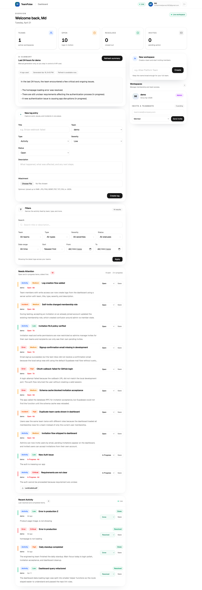
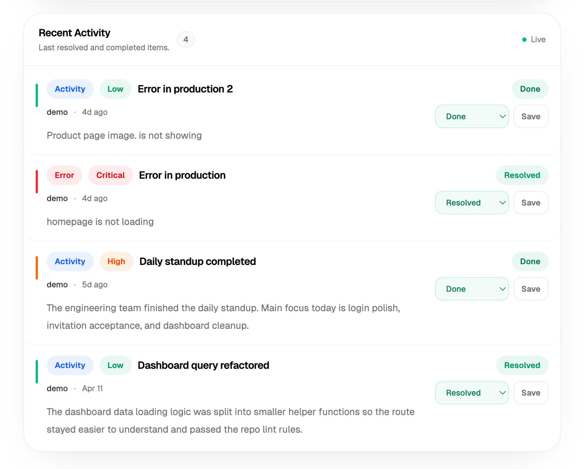
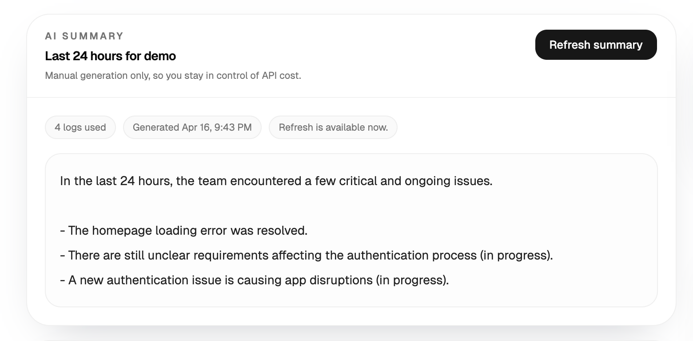

# TeamPulse

TeamPulse is a team activity dashboard for small teams that want a clear view of what is happening day to day.

Instead of scattering updates across chat, docs, and memory, the app gives teams one place to log work, report issues, upload attachments, track status, and review what changed. It also includes AI-generated daily summaries so a team can quickly understand the last 24 hours without reading every single log.

## What It Does

- Teams can create and manage workspaces.
- Admins can invite other people to join a team.
- Team members can create logs for activity, errors, and incidents.
- Logs support severity, status, filters, attachments, and realtime updates.
- AI summaries can be generated on demand for the last 24 hours of team activity.
- Access is role-based:
  - `admin`
  - `member`
  - `viewer`

## Built With

- Next.js 15
- TypeScript
- Supabase Auth, Database, Storage, and Realtime
- OpenAI Responses API
- Tailwind CSS
- shadcn/ui
- Husky for pre-commit and pre-push git hooks

## Running The Project

1. Install dependencies:

```bash
npm install
```

2. Copy the environment file:

```bash
cp .env.example .env.local
```

3. Fill in the required values in `.env.local`:

```env
NEXT_PUBLIC_SUPABASE_URL=
NEXT_PUBLIC_SUPABASE_PUBLISHABLE_KEY=
NEXT_PUBLIC_APP_URL=http://localhost:3001
OPENAI_API_KEY=
OPENAI_SUMMARY_MODEL=gpt-5-mini
```

4. Start the app:

```bash
npm run dev
```

5. Open `http://localhost:3001`.

After `npm install`, Husky is set up through the `prepare` script, so the repo runs git hooks before commit and push.

## Useful Commands

```bash
npm run dev
npm run build
npm run start
npm run lint
npm run typecheck
npm run check
```

## Syncing To The Public Repo

This project was developed in a private working repository and published from a separate clean public repo.

If you want to sync the latest safe changes into the public repo, use:

```bash
rsync -av --delete \
  --exclude='.git' \
  --exclude='node_modules' \
  --exclude='.next' \
  --exclude='.env.local' \
  --exclude='context.md' \
  --exclude='done.md' \
  --exclude='memory' \
  --exclude='.DS_Store' \
  --exclude='.claude' \
  /Users/mohammedparvezj/Documents/personal/TeamPulse/ \
  /tmp/TeamPulse-public/

cd /tmp/TeamPulse-public
git status
git add .
git commit -m "your commit message"
git push origin main
```

## Screenshots





## Project Scope

This repo covers the core TeamPulse workflow:

- authentication and team-based access
- team invitations and role-based permissions
- log creation, filtering, status updates, and attachments
- realtime activity updates
- AI-generated daily summaries for the last 24 hours
